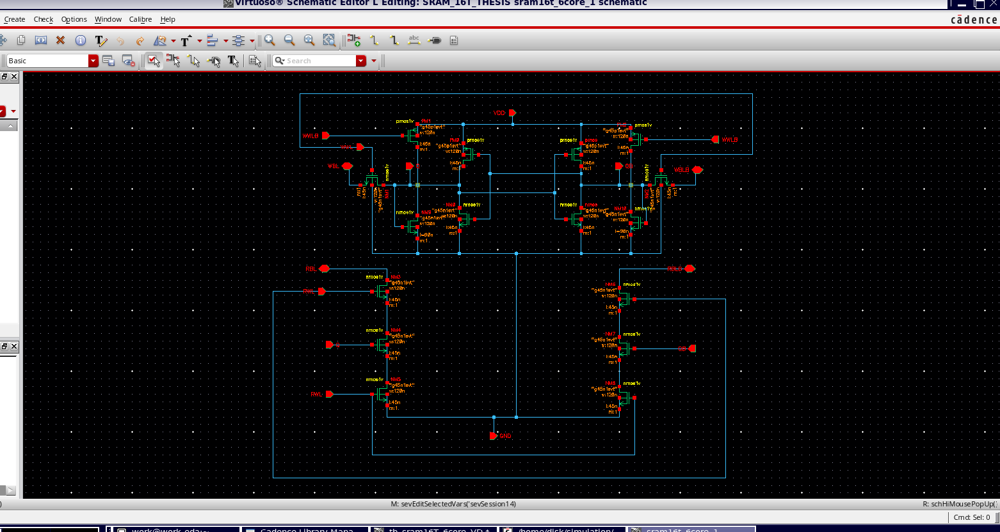
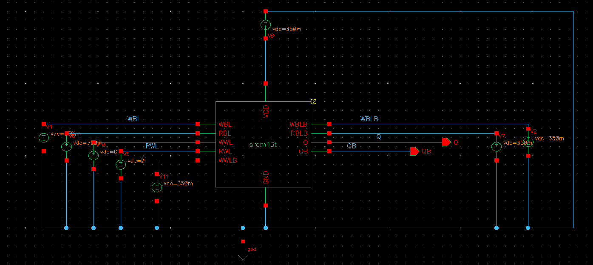
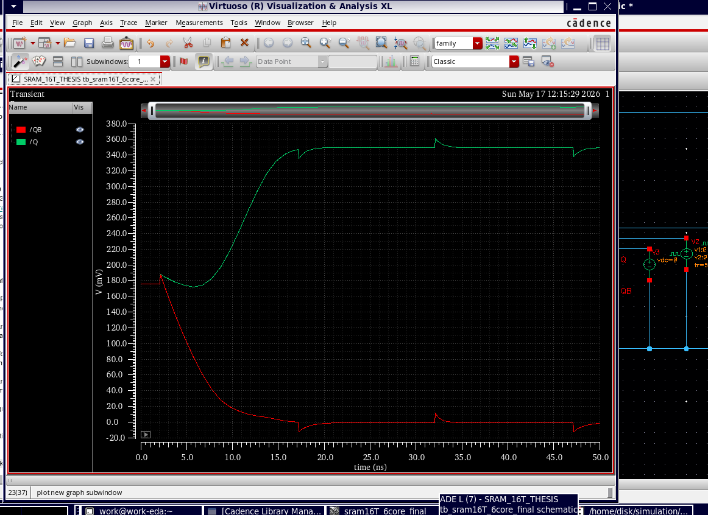
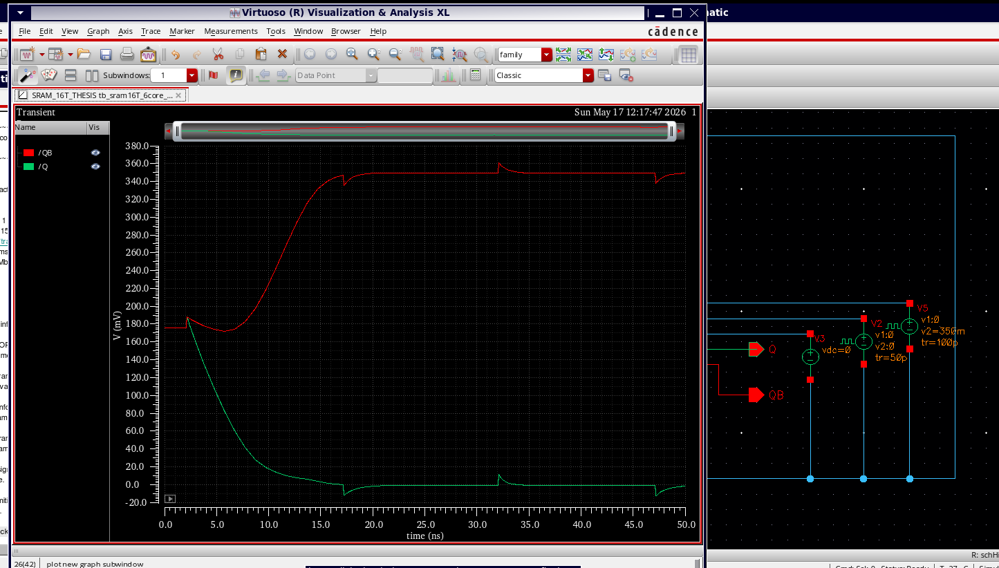
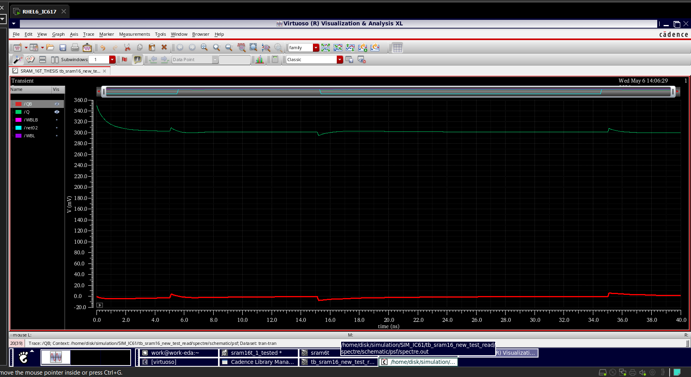
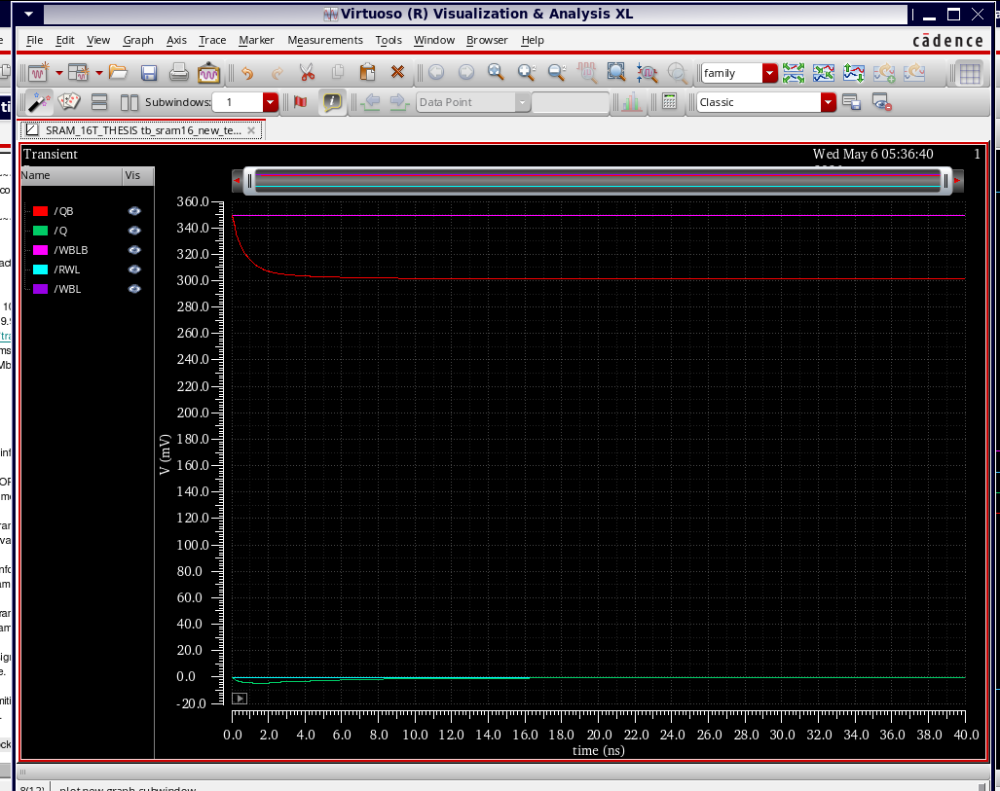
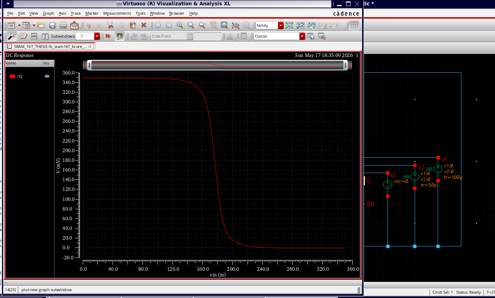
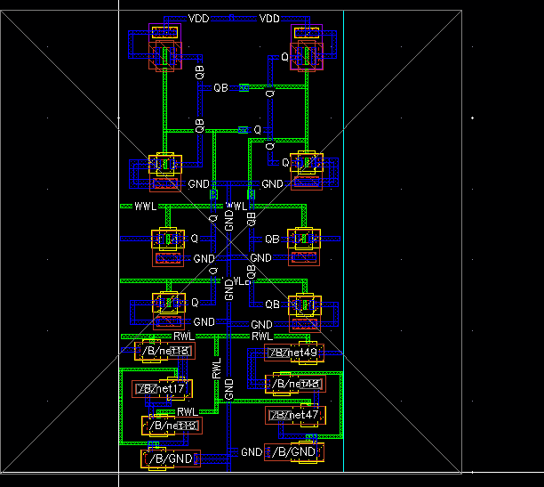
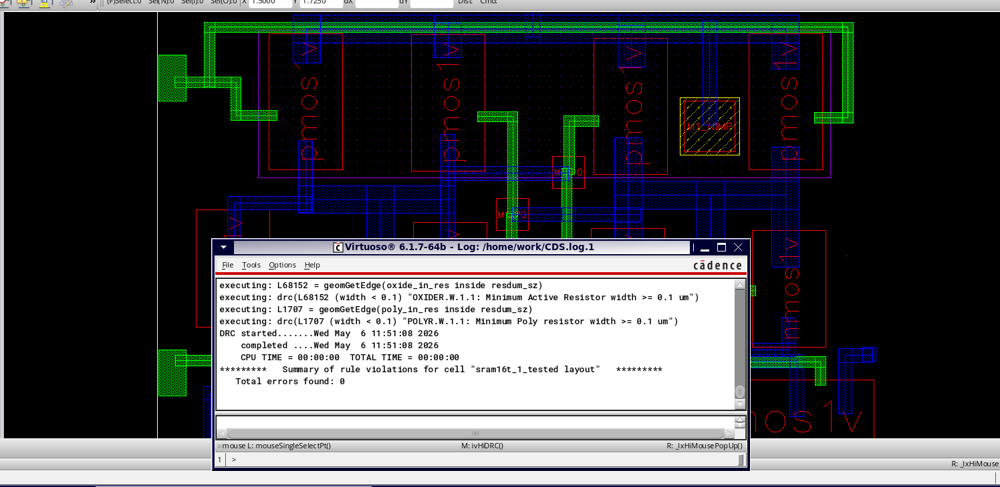

# Low-Voltage 16T SRAM Cell (gpdk045, VDD = 0.35 V)

Transistor-level design, simulation and full-custom layout of a **16-transistor SRAM bitcell** that operates at a near-threshold supply of **0.35 V**. Built in **Cadence Virtuoso IC617** with the **gpdk045** (45 nm) library, and compared against a conventional 6T SRAM cell.

## Why 16T?

At near-threshold voltage, a standard 6T cell suffers from **read disturbance**: during a read, the precharged bitline connects directly to the storage node and can push the stored `0` upward until the cell flips.

This design keeps a 6T-style storage latch but adds **separate write and read ports**:
- The **read path is isolated** from the storage nodes Q/QB, so reading does not disturb the stored data
- The **write path** uses a transmission-gate-style structure (NMOS + PMOS) to keep write drive at low voltage

The trade-off is more transistors, a larger area, and more control signals.

## Architecture

| Group | Function | Signals |
|-------|----------|---------|
| 6T-based storage latch | Two cross-coupled inverters hold Q and QB | VDD, GND |
| Write port | Transmission-gate-style write path | WBL, WBLB, WWL, WWLB |
| Isolated read port | Read stacks driven by Q/QB, not connected to them | RWL, RBL, RBLB |
| Isolation / assist devices | Separate read and write modes | — |

| Mode | WWL | WWLB | RWL |
|------|-----|------|-----|
| Write | VDD | 0 | 0 |
| Read | 0 | VDD | VDD |
| Hold | 0 | VDD | 0 |

**Devices:** gpdk045 `nmos1v` / `pmos1v`, L = 45 nm, W = 120–240 nm

## Results at VDD = 0.35 V

### Functional verification (Spectre transient)

| Operation | Initial (Q, QB) | Final Q | Final QB | Result |
|-----------|-----------------|---------|----------|--------|
| Write-1 | (0, 350 mV) | ≈ 300 mV | ≈ 0 mV | ✅ Pass |
| Write-0 | (350, 0 mV) | ≈ 0 mV | ≈ 300 mV | ✅ Pass |
| Read-1 | (350, 0 mV) | ≈ 350 mV | ≈ 0 mV | ✅ No flip |
| Read-0 | (0, 350 mV) | ≈ 0 mV | ≈ 350 mV | ✅ No flip |
| Hold-1 | (350, 0 mV) | ≈ 300 mV | ≈ 0 mV | ✅ Retained |
| Hold-0 | (0, 350 mV) | ≈ 0 mV | ≈ 300 mV | ✅ Retained |

**Testbench:** DC sources set VDD and the bitlines, and pulse sources drive the write and read wordlines.

**Write-1:** after the write pulse, Q rises to logic 1 and QB falls to 0.

**Write-0:** the mirror case, where QB rises to 1 and Q falls to 0.

**Read-1:** Q and QB stay stable while the read wordline pulses, showing the isolated read port works.

**Hold-0:** with all wordlines off, the stored value stays flat for the whole simulation window.

**DC transfer curve:** sweeping the latch input at 0.35 V gives a sharp switch near VDD/2 (≈ 175 mV), which shows the inverters have enough gain to hold two stable states.

### Additional analysis

- **Temperature:** write, read and hold all pass at −40 °C, room temperature and 125 °C
- **Power:** write draws the most current, read less, and hold only leakage
- **Stability:** hold (HSNM) and read (RSNM) butterfly curves plotted at TT, FF and SS corners
- **Delay:** write and read delays measured from 50 % crossings in the transient waveforms

## Layout

Full-custom layout in Virtuoso Layout Suite. PMOS devices sit in the N-well near VDD, and NMOS devices plus the read stack sit near GND, with N-tap and P-tap connections.

**DRC: 0 violations** after fixing contact spacing, metal spacing and minimum area, N-well and implant enclosure, and tap connections.

## Tools

| Step | Tool |
|------|------|
| Schematic and layout | Cadence Virtuoso IC617 |
| Simulation | Spectre (ADE L / ADE XL) |
| Waveforms | Virtuoso Visualization & Analysis XL |
| DRC / LVS | Virtuoso physical verification (gpdk045 rule deck) |
| Technology | gpdk045, 45 nm generic PDK |

